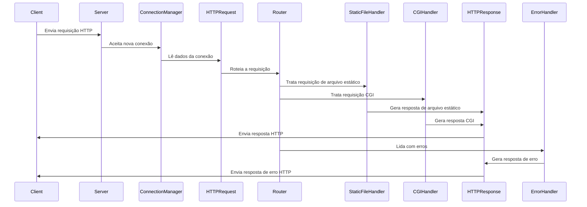

# Webserv

Este projeto é um servidor web simples desenvolvido em C++ como parte do currículo da 42 São Paulo. O servidor implementa funcionalidades básicas do protocolo HTTP, incluindo:

- Processamento de requisições **GET**, **POST** e **DELETE**
- Servir arquivos estáticos
- Suporte a **CGI** para execução de scripts externos
- Gerenciamento de múltiplas conexões simultâneas utilizando `poll()`
- Conformidade com o padrão **HTTP 1.1**
- Aderência ao padrão **C++98**

## Diagrama de Sequência

O diagrama abaixo ilustra o fluxo de funcionamento do servidor:


### Como Executar
1. Compilar o projeto:
    ```
    make
    ```

2. Executar o servidor:
    ```
    ./webserv path/to/config.conf [path/to/logs.log]
    ```
- Substitua path/to/config.conf pelo caminho para o seu arquivo de configuração.
- Opcional: Substitua path/to/logs.log para o seu arquivo de logs


Arquivo de Configuração
O servidor utiliza um arquivo de configuração semelhante ao do NGINX para definir portas de escuta, nomes de servidor, rotas e outras opções.

Exemplo de configuração:
```
server {
    listen 8080;
    server_name localhost;

    location / {
        root /var/www/html;
        index index.html;
        methods GET POST;
    }

    location /cgi-bin {
        root /var/www/cgi-bin;
        cgi_extension .py;
        methods GET POST;
    }
}
```

### Funcionalidades Adicionais
 - Resiliência: O servidor é projetado para não falhar mesmo em condições adversas, como falhas de memória.
 - Multiplataforma: Embora desenvolvido e testado em Linux, utiliza apenas funções compatíveis com C++98.
 - Sem Dependências Externas: Não utiliza bibliotecas externas ou funcionalidades além das permitidas.

### Requisitos
Compilador C++ compatível com o padrão C++98

### Contribuições
Contribuições são bem-vindas! Sinta-se à vontade para abrir issues ou enviar pull requests.
